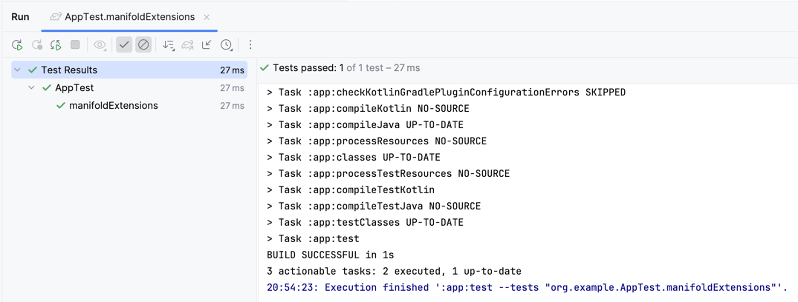
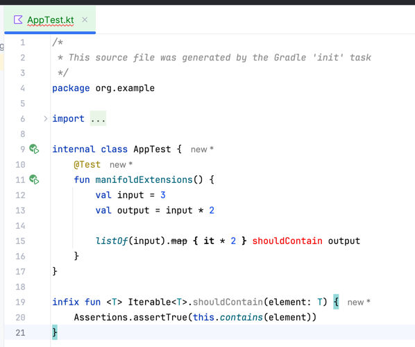

Run `./gradlew test` to verify tests pass:

Open [AppTest.kt](app/src/test/java/org/example/AppTest.kt) to see that the map method is shown as deprecated and infix function is shown as unresolved reference:

